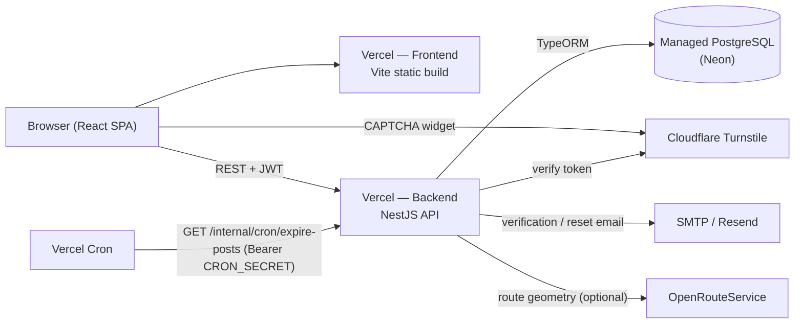

# CargoConnect BiH

A full-stack logistics marketplace that connects companies needing cargo transported with
transport companies and owner-drivers that have available vehicle capacity. Scoped as a
focused MVP for the Bosnia and Herzegovina and Croatia market, with a fully Croatian UI.

> The repository / npm package is named `cargo-platform`; **CargoConnect** is the product name
> used throughout the UI and documentation.

---

## Live Application

| | URL |
|---|---|
| **Live App (frontend)** | **https://cargo-platform-frontend.vercel.app** |
| Backend API | https://cargo-platform-backend.vercel.app |
| API health check | https://cargo-platform-backend.vercel.app/health |

---

## Table of Contents

- [Overview](#overview)
- [Features](#features)
- [Application Flow](#application-flow)
- [Screenshots](#screenshots)
- [Tech Stack](#tech-stack)
- [Architecture](#architecture)
- [Repository Structure](#repository-structure)
- [Local Development](#local-development)
- [Environment Variables](#environment-variables)
- [Database Setup](#database-setup)
- [Authentication & Security](#authentication--security)
- [Email Verification](#email-verification)
- [API Overview](#api-overview)
- [Scheduled Jobs](#scheduled-jobs)
- [Testing](#testing)
- [Build](#build)
- [Deployment](#deployment)
- [Production URLs](#production-urls)
- [Contributing](#contributing)
- [License](#license)

---

## Overview

**What it does.** CargoConnect is a connection platform (not a transport-management system).
Registered companies publish two kinds of listings:

- **Cargo posts** — "I have freight from A to B on this date" (weight, dimensions, required
  vehicle type, price, notes).
- **Vehicle posts** — "I have a truck available from A heading toward B on this date"
  (vehicle type, capacity, notes).

Other users browse and search the opposite side of the marketplace, open a listing, see the
posting company's profile and rating, and start an in-app conversation to arrange the job.

**Problem it solves.** Small carriers and shippers in the region coordinate largely by phone
and informal networks. CargoConnect gives them a single searchable board with normalized
locations, route-corridor matching, and lightweight trust signals (verified accounts,
company profiles, star ratings).

**Intended users.** Small transport companies, owner-drivers, freight forwarders, and
manufacturers/traders in Bosnia and Herzegovina and Croatia.

**Main workflow.**

1. Register a company account and verify the email address.
2. Create a company profile.
3. Publish a cargo post or a vehicle post.
4. Search the other side of the board (with optional route-corridor matching for vehicles).
5. Open a listing and message the posting company.
6. After dealing with a company, leave a 1–5 star rating.

---

## Features

Only features present in the codebase are listed.

### Authentication & account security
- Email + password registration with mandatory email verification (login is blocked until
  the address is verified).
- JWT authentication (HS256), bcrypt password hashing.
- Password reset by emailed link.
- Adaptive CAPTCHA (Cloudflare Turnstile) on registration, password reset, resend
  verification, and on login after repeated failed attempts on an account.
- Per-route rate limiting on all auth endpoints.
- Common-password denylist on registration.
- Password change / reset invalidates all previously issued tokens.
- No permanent account lockout — repeated failures escalate to a CAPTCHA challenge instead.

### Cargo functionality
- Create, edit, and delete cargo posts (edit/delete restricted to the owning company).
- Fields: loading/unloading city, loading date, cargo type, weight, dimensions, required
  vehicle type, price, note.
- Public browsing with pagination and filters.
- Optional driving-route geometry stored per post for map display.

### Vehicle functionality
- Create, edit, and delete vehicle posts (owner-scoped).
- Fields: origin/destination city, available-from date, vehicle type, capacity, note.
- Driving-route geometry plus a computed list of cities the route passes through
  (`vehicle_post_route_cities`), used for corridor matching.

### Search & route matching
- Normalized city table with an autocomplete component (seeded HR + BiH cities).
- Route-corridor matching for vehicle posts: cargo along a truck's route (within a
  configurable distance from the route line) is surfaced, not just exact endpoint matches.
- Cached road-distance lookups (`city_distances`) rendered as "~ X km" on result cards.
- Route map visualization (Leaflet) on listing detail pages.

### User & company functionality
- One company profile per user (name, type, country, city, address, tax number, contacts,
  description).
- Editable user profile and in-app password change.
- Public star ratings (1–5) per user, shown on profiles, listings, and search cards; one
  rating per rater/ratee pair, with aggregate summaries.

### Messaging
- In-app conversations tied to a listing and its two participants.
- Message threads with an unread-count badge.

### Admin functionality
- Role-guarded admin area (`admin` role required).
- Dashboard statistics.
- User list, user detail, role management, user deletion.
- View and edit any user's company profile.
- Cargo/vehicle post moderation: list, change status, delete.
- Bulk operations: expire past-dated posts, close expired posts.
- Regenerate route-city data for vehicle posts.

### Email functionality
- Transactional email via SMTP (Nodemailer): verification email, password-reset email,
  and a "someone tried to register with your address" notice to existing account holders.
- In development without SMTP configured, emails are logged to the console instead of sent.
- In production, missing SMTP configuration is a hard startup failure.

### Automated / scheduled functionality
- Daily post-expiration job (past-dated `active` posts → `expired`).
- Runs as an in-process scheduled task and again once on application startup.
- Also exposed as a `CRON_SECRET`-guarded HTTP endpoint for serverless (Vercel Cron)
  execution, and as manual admin actions.

---

## Application Flow

Frontend routes and their components (`frontend/src/App.tsx`):

| Route | Page | Access |
|---|---|---|
| `/` | Home — marketplace intro, recent listings preview | Public |
| `/login` | Login; inline "resend verification" panel when the account is unverified | Public |
| `/register` | Registration form + Turnstile | Public |
| `/verify-email` | Reads `?token=`, calls the verify endpoint, shows the result | Public |
| `/forgot-password` | Request a password-reset link | Public |
| `/reset-password` | Set a new password from an emailed `?token=` | Public |
| `/cargo`, `/cargo/:id` | Cargo listings and cargo detail | Public |
| `/vehicles`, `/vehicles/:id` | Vehicle listings and vehicle detail | Public |
| `/dashboard` | User dashboard | Authenticated |
| `/company` | Create / edit company profile | Authenticated |
| `/cargo/new`, `/vehicles/new` | Create a listing | Authenticated |
| `/my-posts` | Manage own listings | Authenticated |
| `/profile` | Edit profile, change password | Authenticated |
| `/conversations` | In-app chat | Authenticated |
| `/admin`, `/admin/users`, `/admin/users/:id/company`, `/admin/cargo-posts`, `/admin/vehicle-posts` | Admin area | Admin role |

Route protection is enforced client-side by `ProtectedRoute` / `AdminRoute` wrappers and
server-side by `JwtAuthGuard` / `RolesGuard`.

---

## Screenshots

No screenshots are stored in the repository yet. They can be added here later (for example
under `docs/screenshots/`) once captured.

---

## Tech Stack

### Frontend
| Concern | Choice |
|---|---|
| Framework | React 19 |
| Language | TypeScript |
| Build tool | Vite 8 |
| Routing | React Router 7 |
| HTTP client | Axios (single instance with JWT request interceptor + 401 handling) |
| Maps | Leaflet + react-leaflet |
| Styling | Plain CSS (`index.css`, `App.css`) — no CSS framework |
| Auth handling | JWT + user object in `localStorage`, exposed through `AuthContext` |
| Bot protection | Cloudflare Turnstile widget |

### Backend
| Concern | Choice |
|---|---|
| Framework | NestJS 11 |
| Language | TypeScript |
| Database | PostgreSQL |
| ORM | TypeORM (entities + hand-written migrations; `pg` driver) |
| Auth | `@nestjs/jwt` (HS256) + `passport-jwt`; `bcrypt` for password hashing |
| Validation | `class-validator` / `class-transformer` DTOs; `Joi` schema for environment variables |
| Security headers | `helmet` |
| Rate limiting | `@nestjs/throttler` (custom `LoggingThrottlerGuard`) |
| Email | `nodemailer` (SMTP) |
| CAPTCHA | Server-side Cloudflare Turnstile verification (via `axios`) |
| Scheduling | `@nestjs/schedule` |
| Routing / geo | OpenRouteService HTTP API (`driving-hgv`) + `@turf/turf` for route projection |

### Infrastructure (production)
| Service | Role |
|---|---|
| Vercel | Hosting — two separate projects (frontend, backend) from this monorepo |
| Managed PostgreSQL (e.g. Neon) | Database |
| Resend | SMTP provider for transactional email (`smtp.resend.com`) |
| Cloudflare Turnstile | CAPTCHA |
| OpenRouteService | Driving-route geometry and corridor matching (optional; degrades gracefully) |
| Vercel Cron | Triggers the daily post-expiration endpoint |

---

## Architecture



Request path in production: **Browser → Vercel frontend (static) → Vercel NestJS backend →
managed PostgreSQL**, with Turnstile, SMTP/Resend, and OpenRouteService as third-party
dependencies of the backend.

---

## Repository Structure

```text
.
├── backend/            NestJS API (TypeScript)
├── frontend/           React + Vite SPA (TypeScript)
├── docs/               Detailed project documentation and changelog
├── scripts/            Repo helper scripts (kill-ports for local dev)
├── .github/workflows/  CI pipeline
└── package.json        npm workspaces root
```

### `backend/src/`
| Path | Responsibility |
|---|---|
| `auth/` | Register, login, email verification, password reset; JWT strategy + guards; per-route throttling |
| `users/` | `User` entity (auth + verification + reset + failed-login columns), profile, change password |
| `companies/` | Company profile CRUD (one per user) |
| `cargo-posts/` / `vehicle-posts/` | Listing CRUD, ownership scoping, browse/search, filtering |
| `cities/` | Normalized `City` entity, autocomplete search, batched distance lookup endpoint |
| `routing/` | OpenRouteService client, route-city projection, cached city-pair distances |
| `messaging/` | `Conversation` / `Message` entities, threads, unread count |
| `ratings/` | `Rating` entity, per-user star ratings and summaries |
| `admin/` | Role-guarded moderation and management endpoints |
| `posts-expiration/` | Daily expiration job (scheduled + startup + HTTP trigger) |
| `common/` | `captcha/`, `mail/`, `guards/`, `validators/`, `filters/`, `utils/` (secure token + hashing), shared enums/DTOs |
| `migrations/` | TypeORM migrations (schema source of truth) |
| `seeds/` | `seed-cities.ts` |
| `entities.ts` | Single entity list shared by the app and the migration CLI |
| `data-source.ts` | CLI-only TypeORM `DataSource` for migrations |
| `app.module.ts` / `main.ts` | Module wiring, Joi env schema; bootstrap, Helmet, CORS, global validation & serialization |

### `frontend/src/`
| Path | Responsibility |
|---|---|
| `pages/` | Route components (public, authenticated, and `admin/`) |
| `components/` | Navbar, route guards, `CityAutocomplete`, `RouteMap`, `Turnstile`, rating widgets, and `search/`, `detail/`, `chat/` component kits |
| `context/` | `AuthContext` (JWT + user), `ChatContext` (open conversation + unread badge) |
| `services/` | One Axios client module per resource, plus the shared `api.ts` instance |
| `hooks/` | `useCityDistances`, `useRatingSummaries` |
| `types/`, `utils/`, `constants/` | Shared interfaces, error/date helpers, Croatian label maps |

---

## Local Development

### Prerequisites
- Node.js 24 (CI uses Node 24)
- npm 9+ (workspaces)
- A local PostgreSQL 15+ instance

### Setup

```bash
git clone <repository-url>
cd cargo-platform

# Install all workspaces from the repo root (required — this is an npm
# workspaces monorepo with a hoisted node_modules and a single root lock file)
npm install

# Backend env
cp backend/.env.example backend/.env
# edit backend/.env — at minimum set DATABASE_* and JWT_SECRET

# Frontend env (optional; defaults to http://localhost:3000)
cp frontend/.env.example frontend/.env
```

Create the database referenced by `DATABASE_NAME` (default `cargo_app`) in your local
PostgreSQL. In non-production, TypeORM `synchronize` is **on**, so the schema is created
automatically on first backend start; running the migrations explicitly is also supported
(see [Database Setup](#database-setup)).

### Run

```bash
# Both apps together (kills stale ports first, then runs backend + frontend concurrently)
npm run dev

# Or individually
npm run backend     # NestJS on http://localhost:3000
npm run frontend    # Vite on http://localhost:5173
```

| App | Port |
|---|---|
| Backend API | 3000 |
| Frontend dev server | 5173 |

Optional: seed the city list.

```bash
npm run seed:cities
```

---

## Environment Variables

Do **not** commit real secrets. Use placeholders like the examples below. Reference files:
`backend/.env.example`, `frontend/.env.example`.

### Backend

**Required (all environments)** — validated at startup by the Joi schema in `app.module.ts`:

```env
DATABASE_HOST=localhost
DATABASE_USER=postgres
DATABASE_PASSWORD=your-password
DATABASE_NAME=cargo_app
JWT_SECRET=your-secure-secret-min-16-chars
```

**Required in production only** (`NODE_ENV=production`) — enforced by the Joi schema:

```env
TURNSTILE_SECRET_KEY=your-turnstile-secret
SMTP_HOST=smtp.resend.com
SMTP_FROM=CargoConnect <no-reply@your-verified-domain>
```

**Has a default** (override only if needed):

| Variable | Default | Notes |
|---|---|---|
| `DATABASE_PORT` | `5432` | |
| `JWT_EXPIRES_IN` | `7d` | |
| `PORT` | `3000` | |
| `SMTP_PORT` | `587` | `secure`/implicit-TLS is enabled only when the value is `465` |
| `EMAIL_VERIFICATION_TOKEN_TTL_MINUTES` | `1440` | verification link lifetime (24 h) |
| `PASSWORD_RESET_TOKEN_TTL_MINUTES` | `60` | reset link lifetime |
| `EMAIL_RESEND_COOLDOWN_SECONDS` | `60` | per-account cooldown between verification/reset emails |
| `LOGIN_CAPTCHA_FAILED_ATTEMPTS_THRESHOLD` | `3` | failed logins before a CAPTCHA is required |
| `LOGIN_CAPTCHA_WINDOW_MINUTES` | `15` | window those failures are counted in |
| `RATE_LIMIT_DEFAULT_PER_MIN` | `60` | app-wide default |
| `RATE_LIMIT_REGISTER_PER_MIN` | `5` | |
| `RATE_LIMIT_LOGIN_PER_MIN` | `5` | |
| `RATE_LIMIT_VERIFY_EMAIL_PER_MIN` | `10` | |
| `RATE_LIMIT_RESEND_VERIFICATION_PER_MIN` | `3` | |
| `RATE_LIMIT_FORGOT_PASSWORD_PER_MIN` | `3` | |
| `RATE_LIMIT_RESET_PASSWORD_PER_MIN` | `5` | |

**Optional / not enforced by validation** (read directly via `ConfigService`):

| Variable | Default in code | Notes |
|---|---|---|
| `NODE_ENV` | unset | Set to `production` in production. Turns TypeORM `synchronize` **off**, makes CAPTCHA/SMTP fail closed, and activates the production-only required vars above. Vercel sets this automatically. |
| `CORS_ORIGIN` | `http://localhost:5173` | Allowed browser origin **and** the base URL used to build verification/reset links in emails. Required in practice for production — set it to the frontend URL with no trailing slash. |
| `DATABASE_SSL` | `false` | Set to `true` for managed Postgres such as Neon (`rejectUnauthorized: false`). |
| `SMTP_USER` | unset | For Resend, the literal string `resend`. |
| `SMTP_PASSWORD` | unset | For Resend, your Resend API key. |
| `OPENROUTESERVICE_API_KEY` | unset | Enables route geometry / corridor matching; without it those features degrade gracefully. |
| `ROUTING_PROVIDER` | `openrouteservice` | |
| `ROUTE_CITY_MAX_DISTANCE_KM` | `15` | Max distance from a route line for a city to count as "on the corridor". |
| `CRON_SECRET` | unset | Bearer token required by `GET /internal/cron/expire-posts`; when unset the endpoint always returns `401`. |

### Frontend

```env
# Base URL of the backend API (default: http://localhost:3000)
VITE_API_URL=https://cargo-platform-backend.vercel.app

# Cloudflare Turnstile site key (public, safe to expose) — must pair with the
# backend TURNSTILE_SECRET_KEY
VITE_TURNSTILE_SITE_KEY=your-turnstile-site-key
```

---

## Database Setup

- **Engine:** PostgreSQL (`pg` driver).
- **ORM:** TypeORM. The entity list lives once in `backend/src/entities.ts` and is shared by
  the runtime connection (`app.module.ts`) and the migration CLI (`backend/src/data-source.ts`).
- **Schema management:**
  - Non-production: `synchronize` is enabled, so the schema is created/updated from the
    entities automatically.
  - Production: `synchronize` is disabled. Migrations in `backend/src/migrations/` are the
    schema source of truth and must be run against the production database.

### Migration commands (run from the repo root)

```bash
npm run migration:show      # list applied / pending migrations
npm run migration:run       # apply pending migrations
npm run migration:revert    # revert the last applied migration
npm run migration:generate -- src/migrations/<Name>   # generate from entity changes
npm run migration:create   -- src/migrations/<Name>   # create an empty migration
```

The migration CLI reads database connection settings from `backend/.env` (via
`dotenv/config` in `data-source.ts`). To migrate a remote database, point those variables at
it (including `DATABASE_SSL=true` where required) before running `migration:run`.

### Seeding

```bash
npm run seed:cities         # inserts the Croatia + Bosnia and Herzegovina city list
```

---

## Authentication & Security

Confirmed implementation details:

- **JWT** — HS256, signed with `JWT_SECRET`, default lifetime `7d`. Sent as
  `Authorization: Bearer <token>`. `JwtStrategy` re-loads the user on every request and
  rejects tokens issued before the user's last password change.
- **Password hashing** — `bcrypt` (cost factor 10). Password hashes and other sensitive
  columns are excluded from API responses via serialization.
- **Email verification** — required before login; see the next section.
- **Password reset** — emailed single-use link; completing a reset also revokes existing
  tokens and clears failed-login counters.
- **Verification / reset tokens** — 32 random bytes, delivered raw in the email link, stored
  only as a SHA-256 hash. Time-limited (verification 24 h, reset 1 h by default) and
  single-use (the hash is cleared on success, so a used or already-verified link no longer
  matches anything).
- **CAPTCHA** — Cloudflare Turnstile, verified server-side, on registration, forgot-password,
  resend-verification, and on login once an account has crossed the failed-attempt threshold.
  Fails closed in production if unconfigured.
- **Rate limiting** — `@nestjs/throttler` with per-route limits on every auth endpoint (see
  the `RATE_LIMIT_*` variables) plus an app-wide default. Triggered limits are logged.
- **Account enumeration** — registration, forgot-password, and resend-verification return
  same-shaped generic responses whether or not the email exists.
- **No lockout** — repeated failed logins escalate to a CAPTCHA challenge rather than
  disabling the account.
- **Security headers** — `helmet()` is applied globally.
- **CORS** — a single allowed origin from `CORS_ORIGIN`, credentials enabled.
- **Input validation** — global `ValidationPipe` with `whitelist` + `transform`; a
  common-password denylist validator on registration.
- **Environment validation** — Joi schema fails fast at startup on missing/short required
  variables.

---

## Email Verification

User-facing flow:

1. **Register** at `/register`. The backend creates the account as unverified, generates a
   verification token, and sends a verification email. The API response is generic and does
   not confirm whether the address was new.
2. **Verification email** contains a link to the frontend:
   `${CORS_ORIGIN}/verify-email?token=<token>`.
3. **Click the link.** The `/verify-email` page reads the token and calls
   `POST /auth/verify-email`.
4. **Account verified.** The backend marks the email verified and invalidates the token.
5. **Log in** normally at `/login`. Attempting to log in before verification returns a
   "verify your email" error, and the login page then offers a rate-limited
   "resend verification" action.

Email is sent over SMTP via Nodemailer. The intended production provider is **Resend**
(`SMTP_HOST=smtp.resend.com`, `SMTP_USER=resend`, `SMTP_PASSWORD=<Resend API key>`,
`SMTP_FROM` on a Resend-verified domain). In development without `SMTP_HOST`, the email
body — including the verification link — is written to the backend console instead of sent.
SMTP send failures are logged without the transport credentials and surface to the caller as
a generic "email service unavailable" error.

---

## API Overview

Base URL: `https://cargo-platform-backend.vercel.app` (local: `http://localhost:3000`).
Errors share a consistent JSON shape via the global exception filter. Authenticated routes
expect `Authorization: Bearer <jwt>`.

### Health
| Method | Route | Purpose | Auth |
|---|---|---|---|
| GET | `/health` | Liveness check — `{ status, timestamp }` | Public |

### `/auth`
| Method | Route | Purpose | Auth |
|---|---|---|---|
| POST | `/auth/register` | Create an unverified account, send verification email | Public + CAPTCHA |
| POST | `/auth/login` | Obtain a JWT | Public (+ CAPTCHA when escalated) |
| POST | `/auth/verify-email` | Verify an email address from a token | Public |
| POST | `/auth/resend-verification` | Re-send the verification email | Public + CAPTCHA |
| POST | `/auth/forgot-password` | Send a password-reset link | Public + CAPTCHA |
| POST | `/auth/reset-password` | Set a new password from a token | Public |

### `/cities`
| Method | Route | Purpose | Auth |
|---|---|---|---|
| GET | `/cities` | Autocomplete / filtered city search | Public |
| POST | `/cities/distances` | Batched road-distance lookup for city pairs | Public |

### Cargo posts — `/cargo-posts`
| Method | Route | Purpose | Auth |
|---|---|---|---|
| GET | `/cargo-posts` | Browse cargo posts (paginated, filtered) | Public |
| GET | `/cargo-posts/my` | Current user's cargo posts | Authenticated |
| GET | `/cargo-posts/:id` | Single cargo post | Public |
| POST | `/cargo-posts` | Create | Authenticated |
| PATCH | `/cargo-posts/:id` | Update (owner only) | Authenticated |
| DELETE | `/cargo-posts/:id` | Delete (owner only) | Authenticated |

### Vehicle posts — `/vehicle-posts`
Same shape as cargo posts (`GET /`, `GET /my`, `GET /:id`, `POST /`, `PATCH /:id`,
`DELETE /:id`); browse supports route-corridor matching.

### Companies & users
| Method | Route | Purpose | Auth |
|---|---|---|---|
| GET | `/companies/me` | Current user's company profile | Authenticated |
| POST | `/companies` | Create the company profile | Authenticated |
| PATCH | `/companies/me` | Update the company profile | Authenticated |
| GET | `/users/me` | Current user | Authenticated |
| PATCH | `/users/me` | Update profile | Authenticated |
| PATCH | `/users/change-password` | Change password | Authenticated |

### Messaging — `/conversations`
| Method | Route | Purpose | Auth |
|---|---|---|---|
| GET | `/conversations` | List conversations | Authenticated |
| GET | `/conversations/unread-count` | Unread message count | Authenticated |
| POST | `/conversations` | Start a conversation about a listing | Authenticated |
| GET | `/conversations/:id/messages` | Message thread | Authenticated |
| POST | `/conversations/:id/messages` | Send a message | Authenticated |

### Ratings — `/ratings`
| Method | Route | Purpose | Auth |
|---|---|---|---|
| POST | `/ratings` | Rate a user (1–5) | Authenticated |
| POST | `/ratings/summaries` | Aggregate summaries for several users | Public |
| GET | `/ratings/user/:userId/summary` | One user's rating summary | Public |
| GET | `/ratings/user/:userId/mine` | The current user's rating of that user | Authenticated |

### Admin — `/admin`
All routes require the `admin` role. Includes: `GET /admin/stats`; user management
(`GET /admin/users`, `GET /admin/users/:id`, `PATCH /admin/users/:id/role`,
`DELETE /admin/users/:id`, `GET|PATCH /admin/users/:id/company`); post moderation
(`GET /admin/cargo-posts`, `GET /admin/vehicle-posts`, `PATCH .../:id/status`,
`DELETE .../:id`); bulk actions (`POST /admin/posts/expire-old`,
`GET /admin/posts/expired-count`, `POST /admin/posts/close-expired`); and route
regeneration (`POST /admin/vehicle-posts/regenerate-all-routes`,
`POST /admin/vehicle-posts/:id/regenerate-route-cities`).

### Internal
| Method | Route | Purpose | Auth |
|---|---|---|---|
| GET | `/internal/cron/expire-posts` | Run the daily expiration job | `Authorization: Bearer <CRON_SECRET>` |

---

## Scheduled Jobs

**Post expiration.** Cargo posts past their loading date and vehicle posts past their
available-from date, still marked `active`, are moved to `expired`.

- **In-process:** `PostsExpirationService` runs the job every day at midnight (server local
  time) via `@nestjs/schedule`, and once more on application startup to catch anything
  missed while the process was down.
- **Serverless (production):** because an in-process timer does not fire reliably on
  serverless functions, the job is also exposed as
  `GET /internal/cron/expire-posts`, guarded by an `Authorization: Bearer <CRON_SECRET>`
  header. `backend/vercel.json` declares the schedule:

  ```json
  {
    "crons": [
      { "path": "/internal/cron/expire-posts", "schedule": "0 0 * * *" }
    ]
  }
  ```

  Vercel Cron calls it daily at `00:00 UTC` with the `CRON_SECRET` bearer token; any request
  without the matching secret is rejected with `401`. The secret is set as a Vercel
  environment variable and is never committed.
- **Manual:** admins can trigger it through `POST /admin/posts/expire-old` and
  `POST /admin/posts/close-expired`.

---

## Testing

Backend tests use Jest. Run from the repo root:

```bash
npm run test        -w backend      # unit tests (12 spec suites)
npm run test:watch  -w backend
npm run test:cov    -w backend      # with coverage
npm run test:e2e    -w backend      # end-to-end suite (boots AppModule against a database)
```

Covered by unit specs: auth service, admin service, cargo/vehicle post services,
posts-expiration service, ratings service, conversations service, CAPTCHA service,
city-distance service, the common-password validator, the LIKE-escape helper, and the app
controller.

CI (`.github/workflows/ci.yml`) runs on every push and pull request (Node 24):

- **Backend job:** `npm ci`, build, lint, unit tests, and e2e tests against an ephemeral
  PostgreSQL 15 service container.
- **Frontend job:** `npm ci`, build, lint.

The frontend has no automated test suite; `npm run lint -w frontend` is the check.

---

## Build

```bash
# Both
npm run build                 # backend (nest build) then frontend (tsc -b && vite build)

# Individually
npm run build -w backend      # compiles to backend/dist/
npm run build -w frontend     # type-checks and bundles to frontend/dist/

# Preview the built frontend locally
npm run preview -w frontend
```

---

## Deployment

Production runs as **two independent Vercel projects from this single monorepo**:

| Project | Root directory | Notes |
|---|---|---|
| Frontend | `frontend/` | Vite static build. `frontend/vercel.json` rewrites all paths to `index.html` for client-side routing. |
| Backend | `backend/` | NestJS API. `backend/vercel.json` declares the daily cron schedule. |

**Database:** managed PostgreSQL (e.g. Neon), reached over SSL (`DATABASE_SSL=true`).
Migrations are run manually against the production database — `synchronize` is disabled when
`NODE_ENV=production`.

**Deployment configuration (set as Vercel environment variables, never in the repo):**

- **Frontend project:** `VITE_API_URL` (the backend URL, no trailing slash),
  `VITE_TURNSTILE_SITE_KEY`.
- **Backend project:** `DATABASE_HOST` / `DATABASE_PORT` / `DATABASE_USER` /
  `DATABASE_PASSWORD` / `DATABASE_NAME` / `DATABASE_SSL=true`; `CORS_ORIGIN` (the frontend
  URL, no trailing slash); `JWT_SECRET` (and optionally `JWT_EXPIRES_IN`);
  `TURNSTILE_SECRET_KEY`; `SMTP_HOST` / `SMTP_PORT` / `SMTP_USER` / `SMTP_PASSWORD` /
  `SMTP_FROM`; `CRON_SECRET`. `NODE_ENV=production` is provided by Vercel.

After changing `VITE_API_URL` or `CORS_ORIGIN`, redeploy the affected project(s) so the new
values take effect (the frontend value is baked in at build time).

---

## Production URLs

| Purpose | URL |
|---|---|
| Frontend / Live App | https://cargo-platform-frontend.vercel.app |
| Backend API | https://cargo-platform-backend.vercel.app |
| Health check | https://cargo-platform-backend.vercel.app/health |

---

## Contributing

1. Create a branch from `master` (`git checkout -b feature/short-description`).
2. Make your changes. Keep backend behavior changes reflected in `docs/` and add a
   `docs/changelog/` entry where relevant.
3. Run the checks locally:
   ```bash
   npm run build
   npm run lint  -w backend && npm run lint -w frontend
   npm run test  -w backend
   ```
4. For schema changes, add a TypeORM migration (do not rely on `synchronize` for
   production).
5. Open a pull request. CI must pass.

---

## License

No `LICENSE` file is present and the root `package.json` declares no license, so the
repository currently does not grant any license. `backend/package.json` is marked
`"private": true` / `"license": "UNLICENSED"`. All rights are reserved by the author unless a
license is added later.
